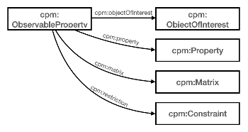

# I-ADOPT to Complex Property Model

The Complex Properties Model (CPM) [CPM, 2016; CPM-docs] is an ontology designed to describe observational data from across Earth Science disciplines, including ecology, geochemistry, hydrology, and oceanography.
It extends the notion of an Observable Property, or Base Phenomenon from the Observation & Measurement model, and decomposes it into the following atomic components: Object of Interest, Property, Matrix, Constraint, Statistical Measure, and Unit.
Of these components, the Object of Interest, Property, Matrix and Constraint can be aligned with the similarly named components in the I-ADOPT Framework.
The Object of Interest and the Property are required, while the Matrix, the entity within which the object of interest is ‘embedded, dissolved, or otherwise entailed’, and Constraint are optionally added to further specify the Observable Property.
Notable differences between CPM and I-ADOPT are that (1) Object of Interest and Matrix are classes in CPM and predicates indicating roles that Entities play in I-ADOPT, (2) Constraint in CPM is a catch-all category for terms that are split up into Constraint and Context Object in I-ADOPT and (3) CPM also includes units and statistical measures as components, whereas I-ADOPT explicitly does not include those components because a variable might be expressed in different units and be associated with different statistical measures.

| CPM                    | I-ADOPT                                               |
|------------------------|-------------------------------------------------------|
| cpm:ObservableProperty | iop:Variable                                          |
| cpm:ObjectOfInterest   | iop:Entity + iop:hasObjectOfInterest                  |
| cpm:Property           | iop:Property                                          |
| cpm:Matrix             | iop:Entity + iop:hasMatrix                            |
| cpm:Constraint         | iop:Constraint   iop:Entity + iop:hasContextObject |

## References

* [CPM, 2016] Adam M. Leadbetter & Peter N. Vodden (2016) Semantic linking of complex properties, monitoring processes and facilities in web-based representations of the environment, International Journal of Digital Earth, 9:3, 300-324, DOI: [10.1080/17538947.2015.1033483](https://doi.org/10.1080/17538947.2015.1033483)
* [CPM-docs] [http://purl.org/voc/cpm](http://purl.org/voc/cpm), Accessed: 3 November 2021
