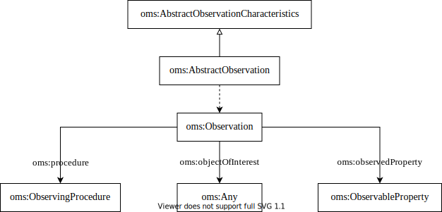

# I-ADOPT to Observations & Measurements & Samples (OMS)

Observations & Measurements & Samples (OMS) [OMS-docs] is the latest revision of O&M (still not officially published) and it exists so far only as a conceptual model (as UML).
It leverages the O&M and includes the Sampling Feature or Sample from SOSA.
It introduces new classes like Abstract Observation and Abstract Observation Characteristics which might be a possible mapping to an I-ADOPT Constraint.
Alternatively a constraint might be a constraint within the ObservingProcedure.
Similarly as in SOSA the Observable Property maps to Variable and the Feature Of Interest corresponds to an Entity having the role of a Context Object.

| OMS                    | I-ADOPT                                               |
|------------------------|-------------------------------------------------------|
| oms:ObservableProperty | iop:Variable                                          |
| oms:FeatureOfInterest  | iop:Entity + iop:hasObjectOfInterest                  |
| ?oms:constraints on the ObservingProcedure or ?oms:AbstractObservationCharacteristics | iop:Constraint                                          |

## References

* [OMS] Katharina Schleidt, Ilkka Rinne, Sylvain Grellet (2021) OGC Abstract Specification. Geographic Information - Observations, Measurements and Samples; OGC 20-082r2 and ISO 19156:2020. https://github.com/opengeospatial/om-swg/tree/master/oms-abstract-spec/ogc-as-topic20
* [OMS-docs] http://iso.sparxcloud.com/login.php
