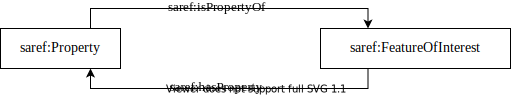

# I-ADOPT to Smart Applications REFerence Ontology

The Smart Applications REFerence Ontology (SAREF) [SAREF-docs] is an ontology for connecting information collected by devices as part of the Internet of Things.
Its components that refer to what is measured are the FeatureOfInterest and the Property.
The FeatureOfInterest is the whole of what is being measured, so this maps to the I-ADOPT combination of all Entities (and their assigned roles) involved in a Variable and associated Constraints.
The Property maps to the I-ADOPT Variable.

| SAREF                   | I-ADOPT      |
|-------------------------|--------------|
| saref:Property          | iop:Variable |
| saref:FeatureOfInterest | iop:Entity   |

## References

* [SAREF-docs] https://saref.etsi.org/index.html Accessed: 3 November 2021
