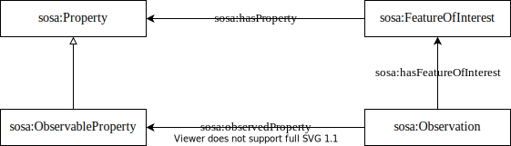

# I-ADOPT to SOSA

The lightweight ontology SOSA (Sensor, Observation, Sample, and Actuator) is the core ontology of the Semantic Sensor Network (SSN) ontology, which describes sensors and their observations, the involved procedures, the studied feature of interest, the samples used to do so, and the observed properties, as well as actuators.
SOSA implements O&M (Observations and Measurements) also as a stand-alone ontology and is focused on modelling observations.
The Observation is an act carrying out a Procedure to estimate or calculate a value of a Property of a Feature Of Interest.
The Observable Property is an observable quality of a Feature Of Interest and can be directly mapped to the I-ADOPT Variable.
The Feature Of Interest is the real thing whose property is being estimated or calculated at a specific time and space and corresponds to the instance of the Entity type playing the role of an I-ADOPT Context Object (and not of the Object of Interest).
The Context Object is normally the component of the environment addressed by the variable to be finally observed, usually through a sampling process.

| SOSA                    | I-ADOPT                           |
|-------------------------|-----------------------------------|
| sosa:ObservableProperty | iop:Variable                      |
| sosa:FeatureOfInterest  | iop:Entity + iop:hasContextObject |
