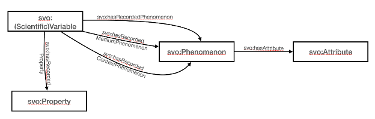

# I-ADOPT to Scientific Variables Ontology

The Scientific Variables Ontology (SVO) [SVO, SVO2, SVO-docs] is an ontological framework designed to describe scientific variables for the purpose of aligning data with computational model inputs and coupling model inputs and outputs. 
SVO is applicable to the physical, chemical, and biological sciences. 
The core element of SVO is the Variable which is decomposed into a Phenomenon and a Property. 
These entities map one-to-one to the I-ADOPT Variable, Entity, and Property categories, respectively.
In SVO, Phenomena are defined recursively as a nested and branched composition of other Phenomena; the ContextPhenomenon and MediumPhenomenon are compound Phenomena that use simple design patterns to assign roles to two or more Phenomena in combination. 
The SVO Attribute, defined as a Property-Value (such as gas phase or blue color), can be loosely mapped to the I-ADOPT Constraint. 
Notable differences between SVO and I-ADOPT are that (1) SVO initially stores Context and Medium Phenomena as chained, reified design patterns and then uses rules and dynamic inferencing to generate the relationships between the Variable and nested components while I-ADOPT directly stores all of the relationships between a Variable and its components and (2) the SVO Attribute is used to constrain atomistic components of a Variable whereas the I-ADOPT Constraint is applied to the Variable as a whole.

| SVO                              | I-ADOPT                 |
|----------------------------------|-------------------------|
| svo:Variable                     | iop:Variable            |
| svo:Phenomenon                   | iop:Entity              |
| svo:Property                     | iop:Property            |
| svo:Attribute                    | iop:Constraint          |
| svo:hasRecordedPhenomenon        | iop:hasObjectOfInterest |
| svo:hasRecordedMediumPhenomenon  | iop:hasMatrix           |
| svo:hasRecordedContextPhenomenon | iop:hasContextObject    |

## References

* [SVO] Stoica, M., & Peckham, S. D. (2018). An Ontology Blueprint for Constructing Qualitative and Quantitative Scientific Variables. In International Semantic Web Conference (P&D/Industry/BlueSky).
* [SVO2] Stoica, M., & Peckham, S. D. (2019). The scientific variables ontology: A blueprint for custom manual and automated creation and alignment of machine-interpretable qualitative and quantitative variable concepts. In Modeling the World's Systems Conference.
* [SVO-docs] http://scientificvariablesontology.org, Accessed: 2 November 2021
