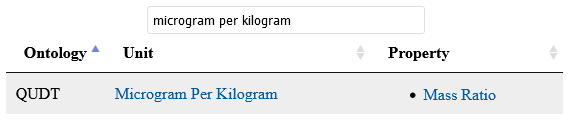
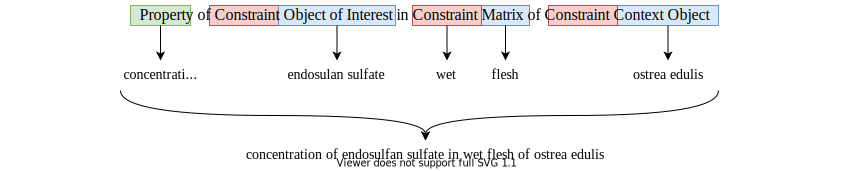

# Step-by-step guide for Minting new Variables

The first step in identifying suitable variable descriptions should always be a search, e.g., using the [I-ADOPT Catalogue of Terminologies](https://i-adopt.github.io/terminologies/).
However, sometimes this does not yield proper results and new variable descriptions have to be created.
Before you start creating new variable descriptions, please make sure that you have the means to also publish those descriptions, so others can make use of them as well.
If you do not have access to a terminology provider yourself, please consider contacting providers relevant to your field.

The guide below is the result of various workshops for modeling variables during the lifespan of the I-ADOPT WG. 
It is not intended as a compulsory specification, but summarizes the experiences of the I-ADOPT WG and gives newcomers a starting point in how to model variables. 
The following steps will be illustrated by reusing the running example of "concentration of endosulfan sulfate in wet flesh of ostrea edulis".

1. **Understand**

    A clear understanding of the phenomena that your variable should describe is essential. Either you have the domain expertise or you need to have a domain expert at your side.

2. **Analyze**

    Identify what components are needed to describe your observation. 
    Components are reusable atomic parts of the variable description. 
    Ask yourself the question: Could this component be a meaningful part of other variable descriptions as well? 
    If the answer is yes, you most likely found a new component. 
    If not, you probably need to split it up even more.

    <ins>*Example*</ins>

    

3. **Generalize**

    The identified components are often only specialized variations of more generic concepts. 
    Try to find more general concepts that describe each component. 
    Such concepts can include one of the below examples and others like “method”, “condition”, or “unit”. For now, also multiple such concepts are possible.

    <ins>*Example*</ins>

    

4. **Check Existing Patterns**

    The I-ADOPT WG has prepared a collection of Variable Design Patterns in a Github repository.
    Check whether any of those patterns can be applied to your variable description.

    * **Apply the Pattern**

        If you could find a matching pattern, replace the abstract concepts of the pattern with the specialized components identified in Step 2.
        This will already result in a proper variable description including roles and relations, now please proceed with step 11.

5. **Look at Associated Data**

    Values within the dataset to be described can give important hints for the further analysis. 
    First and foremost is the distinction into quantitative and qualitative values.
    * Quantitative values are expressed by one or multiple numbers and often include a unit of measure.
    * Qualitative values are, in general, text-literals and may draw from a specific vocabulary.
    
    The unit of measure or the vocabulary used for the values of a variable will help to narrow down the list of possible properties in the next step.

    <ins>*Example*</ins>

    Values of “concentration of endosulfan sulfate in wet flesh of ostrea edulis” are measured, e.g., in *micrograms per kilogram*.

6. **Identify the Property**

    The Property is a generalized characteristic expressed by the value and is sometimes also called Quantity Kind.
    If the Property is not known, it may be deduced from the unit (e.g., using [I-ADOPT's Unit-to-Property Lookup](https://i-adopt.github.io/terminologies/unit2property)) or the vocabulary used to define possible values.

    <ins>*Example*</ins>

    

    or

    

7. **Identify the Object of Interest**

    The Object of Interest is one of the entities involved in the observation. In particular, it is the Entity whose Property is observed.

    <ins>*Example*</ins>

    

8. **Identify the Matrix** (if available)

    If the Object of Interest is embedded in or a particular part of another Entity, that Entity is the Matrix of the observation. 
    Note that not every observation necessarily contains a Matrix.

    <ins>*Example*</ins>

    

9. **Identify the Context Object(s)**

    Context Objects are all other Entities needed to describe the Variable and provide essential contextual information to comprehensively describe the observation.

    <ins>*Example*</ins>

    

10. **Further Decompose Entities** (if possible)

    Revisit the identified Entities (Object of Interest, Matrix, and Context Object(s)) once again. 
    Check whether it is possible to further decompose them into more general concepts and Constraints that confines their scope in this particular scenario.

    <ins>*Example*</ins>

    

11. **Annotate with Concepts**

    Describe each component with a concept from a commonly available terminology. 
    You may consult the [I-ADOPT Catalogue of Terminologies](https://i-adopt.github.io/terminologies/list/all) to find suitable terminologies. 
    It lists terminologies for the classes defined in I-ADOPT. 
    Terminologies for Entities are not further distinguished as they may appear in different roles depending on the Variable.

    <ins>*Example*</ins>

    

12. **Label the Variable**

    Think about the use of two labels - a preferred and an alternative one.

    The preferred one should be the one used in your community, but make sure that you and the community fully agree on the meaning.

    The alternative label should contain all components of the variable and follow a consistent grammar common to other variables either by you or within the same terminology.

    <ins>*Example*</ins>

    

13. **Create the Variable Concept**

    Mint a IRI for the Variable and attach the previously identified components according to the I-ADOPT ontology  (`iop:hasProperty`, `iop:hasObjectOfInterest`, `iop:hasMatrix`, `iop:hasContextObject`, `iop:hasConstraint`).

14. **Add further Associations** (optional)

    Beyond the concepts provided by I-ADOPT, further information might be needed to describe the full extent of the variable.
    You can use other vocabularies to attach additional associations as well.
